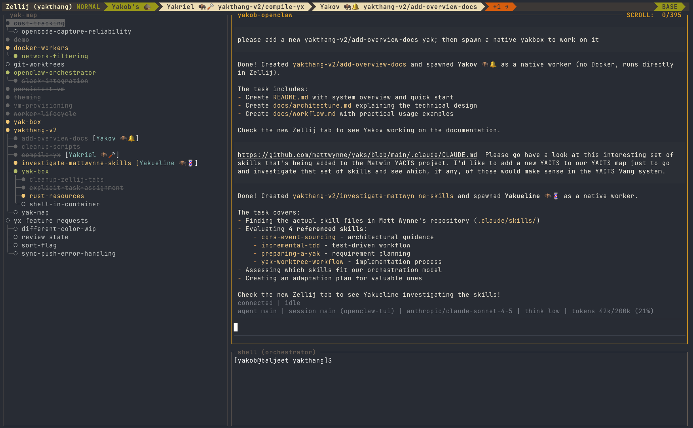

# Yakthang — Yak Orchestration System

Yakthang is an autonomous software orchestration system. Think of it as a digital yak ranch — each "yak" is a task that needs shaving (completion), and "yak shavers" are autonomous agents that do the work.

## The Philosophy of Yak Shaving

The term "yak shaving" describes a familiar situation: you have a goal, but along the way you discover a cascade of smaller tasks you must complete first. Want to deploy that feature? First you need tests. Want tests? First you need CI setup. Want CI? First you need infrastructure. Each "yak" that appears on the path to your goal wasn't planned — it just appeared.

Yakthang is designed to manage exactly this kind of work. When you're trying to accomplish something and find yourself shaving yaks to shave yaks, Yakthang helps you track all of them, organize them, and parallelize the work.

### What is a Yakthang?

A play on the Tibetan: ཡིག་ཐང་, yik tang - the high-altitude plateau in Tibet where yaks roam free. In the context of this project its a VM where everything runs - ie; the _tang_ where yaks get mapped and shaved.

## The Big Picture

The primary interface is **Zellij** — a terminal multiplexer that provides the orchestration environment. When you run `./launch.sh`, you open **Yakob's Yurt**, which looks like this:



### YakMap — Visual Task Map

The left pane runs a **YakMap Zellij WASM plugin** (`bin/yak-map.wasm`) that visualizes your yak map in real-time. It reads `.yaks/` directly (no dependency on the `yx` binary) and displays:
- All tasks and their states with color-coded status (green=wip, grey=done, white=todo)
- Task hierarchy with tree visualization and continuation lines
- Worker assignments and agent status annotations
- Keyboard navigation (↑/↓) with selected task highlighting

### Yakob — The Orchestrator

The right pane runs **Yakob**, a long-running OpenClaw instance that:
- Plans and organizes work into the yak map
- Spawns yak shavers to work on tasks
- Monitors progress and handles blocked tasks
- Coordinates parallel work

You interact with Yakob directly in this pane — map new yaks, spawn yak shavers, check status, or give guidance.

### Yak Shavers — The Workers

Yak shavers spawn as **additional Zellij tabs**, each running an OpenCode instance with the context of a specific yak. They operate **semi-autonomously**:
- Given a yak's context, they work independently
- For straightforward tasks, they proceed without intervention
- For complex issues, you can focus their tab and provide additional guidance

Yak shavers obviously have Yak inspired names - Yakriel, Yakov, Yakueline.  Noticing the theme yet :)

### Optional: Messaging Integration

You can optionally configure Slack/Telegram integration for:
- Receiving notifications when yaks complete
- Remote status queries
- Triggering new yaks from chat

But most interaction happens in Zellij — messaging is optional.

## Key Components

### yx — Task Tracker

A DAG-based TODO list for tracking work:

```
$ yx ls
NAME                      STATUS       PRIORITY
yakthang-v2/add-overview  wip          high
auth-api                  pending      medium
frontend-refactor         blocked      low
```

Each task has:
- **Context** — Detailed requirements and notes
- **Status** — pending, wip, done, blocked
- **Custom fields** — agent-status, priority, depends-on, etc.

### yak-box — Worker Manager

Go CLI tool for spawning yak shavers (built from `src/yak-box/`):

```bash
# Spawn a sandboxed shaver for API tasks
yak-box spawn --cwd ./api --name api-shaver --yaks auth/api

# Spawn a native shaver with heavy resources
yak-box spawn --cwd ./backend --name backend-shaver --runtime native --resources heavy

# Spawn with automatic git worktree isolation
yak-box spawn --cwd ./api --name api-auth --yaks auth/api --auto-worktree

# Check status of all shavers (includes live cost)
yak-box check

# Stop a shaver gracefully
yak-box stop api-shaver
```

Shavers run in two modes:
- **Sandboxed** — Docker container with resource limits, security hardening, and persistent worker homes at `.yak-boxes/@home/{Persona}/`
- **Native** — Direct execution on the host with full system access

Key features:
- **DevContainer support** — Reads `.devcontainer/devcontainer.json` for custom images, env vars, mounts, and post-create commands
- **Automatic worktree management** — `--auto-worktree` creates isolated git worktrees per task at `~/.local/share/yakthang/worktrees/`
- **Persistent worker homes** — Worker state (SQLite DB, shell history) survives container restarts and crashes
- **Cost tracking** — `yak-box check` shows live cost per running worker; `cost-summary.sh` gives unified reports

### .yaks/ — Task Directory

Stores task state as a directory tree:

```
.yaks/
├── yakthang/
│   ├── add-overview-docs/
│   │   ├── context       # Task requirements
│   │   └── agent-status  # Current worker status
│   └── compile-yx/
├── auth/
│   └── api/
└── frontend/
```

### .yak-boxes/ — Worker Metadata

Runtime directory for shaver instances:

```
.yak-boxes/
├── add-overview-docs.meta   # Shaver configuration
├── compile-yx.meta
```

## How It Works

### 1. You Work with Yakob in the Main Pane

In the Yakob pane, type your request:

```
Add user authentication to the API
```

### 2. Yakob Creates the Yak

Yakob creates a task in `.yaks/` with context from your request.

### 3. Yakob Spawns Yak Shavers

Yakob calls `yak-box spawn` to create new Zellij tabs with shavers.

### 4. Shavers Work (Semi-Autonomously)

Each shaver runs in its own tab with the yak's context. For simple tasks, they proceed independently. For complex work, you can focus their tab and provide guidance.

### 5. Progress Visible in YakMap

The YakMap pane updates in real-time as shavers update task status.

## Quick Start

### Launch the Orchestrator

```bash
./launch.sh
```

This opens Zellij with YakobsYurt:
- **Left pane**: YakMap — live task visualization
- **Right top**: Yakob (OpenClaw 2E) — orchestration
- **Right bottom**: Shell — manual commands

### Work with Yakob

In the main Yakob pane, ask for work:

```
Yakob: add a login endpoint to the API
Yakob: creating yak: auth-api-login
Yakob: spawning api-shasher...
```

### Monitor

```bash
# From shell pane - check all shavers and tasks
yak-box check

# Or just watch YakMap in the left pane
```

### Interact with a Shaver

When a shaver needs guidance, focus their tab:

```
Can you also add logout? And handle token expiry properly.
```

### Handle Blocked Shavers

```bash
yx state my-feature blocked
yx field my-feature agent-status "blocked: waiting for API spec"
```

## Workflow Examples

### Basic Workflow

```
1. In Yakob pane: "implement user auth"
2. Yakob creates yak, spawns shaver
3. Watch progress in YakMap
4. Shaver completes, YakMap shows done
5. Optionally: focus shaver tab to review work
```

### Parallel Workflow

```
1. "add user, product, and order APIs"
2. Yakob creates three yaks
3. Yakob spawns three shavers in parallel
4. YakMap shows all working simultaneously
5. Each completes independently
```

### Interactive Workflow

```
1. Yakob spawns shaver for complex feature
2. Shaver gets stuck on an edge case
3. You focus their tab
4. Give additional context: "check how other endpoints do validation"
5. Shaver continues with new guidance
```

## Design Philosophy

- **Zellij-first**: Primary interface is the terminal multiplexer
- **Semi-autonomous**: Shavers work independently, but you can intervene
- **Visual**: YakMap provides real-time task visualization
- **Isolated**: Shavers run in containers or separate contexts
- **Observable**: Task state always visible in YakMap

## Directory Structure

```
yakthang/
├── bin/
│   ├── yak-box           # Worker manager CLI (Go)
│   ├── yak-map.wasm      # YakMap Zellij WASM plugin (Rust)
│   ├── yx                # Task tracker CLI (shell)
│   └── archive-yaks.sh   # Archive completed tasks to memory/
├── src/
│   ├── yak-box/          # yak-box source (Go)
│   ├── yak-map/          # YakMap plugin source (Rust/WASM)
│   └── yaks/             # yx CLI source (shell)
├── docs/                 # Specs, design docs, guides
├── memory/               # Archived task outcomes (organized by goal)
├── scripts/              # Operational scripts
├── .devcontainer/        # DevContainer config for worker images
├── .opencode/            # OpenCode/OpenClaw workspace config
├── orchestrator.kdl      # Zellij layout definition
├── launch.sh             # Entry point
├── cost-*.sh             # Cost tracking scripts
├── .yaks/                # Task state directory (gitignored)
├── .yak-boxes/           # Worker metadata + persistent homes
│   └── @home/            # Persistent worker home dirs
└── .worker-costs/        # Exported cost data + CSV history
```

## See Also

- [docs/worker-spawning.md](docs/worker-spawning.md) — Worker spawning details
- [docs/orchestrator-layout.md](docs/orchestrator-layout.md) — Terminal layout
- [docs/cost-tracking.md](docs/cost-tracking.md) — Cost tracking system
- [docs/task-management.md](docs/task-management.md) — Task management with yx
- [docs/plan-build-modes.md](docs/plan-build-modes.md) — Plan vs Build worker modes
- [docs/development/DOCKER-MODE.md](docs/development/DOCKER-MODE.md) — Docker runtime architecture
- [docs/specs/yak-box-design.md](docs/specs/yak-box-design.md) — yak-box design spec
- [docs/specs/yak-map-design.md](docs/specs/yak-map-design.md) — YakMap plugin design
